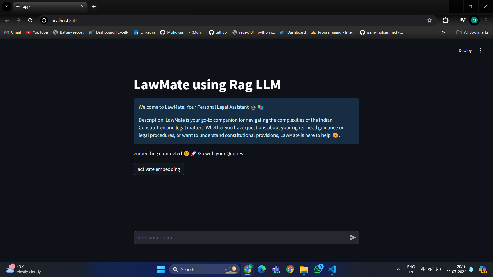
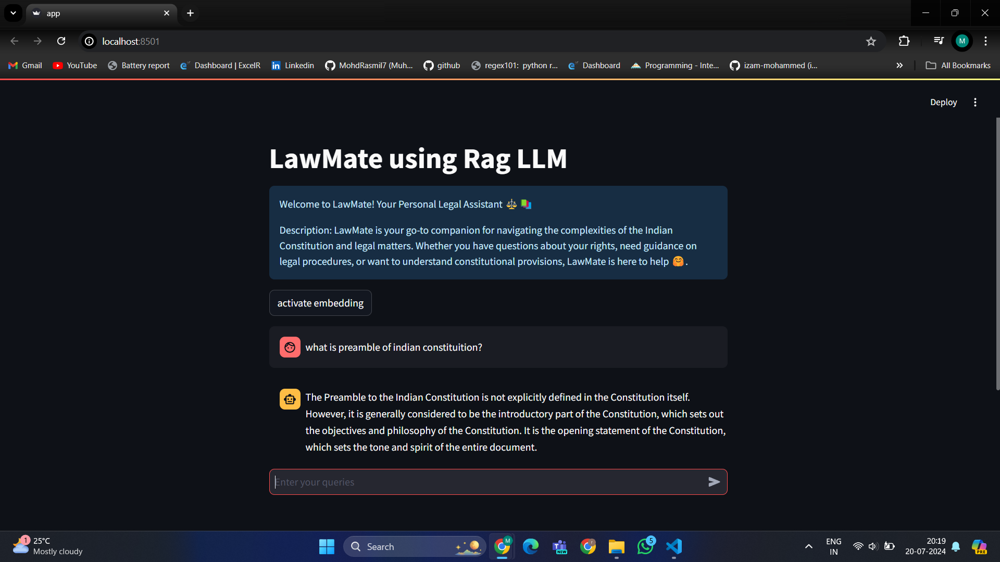

# LawMate: Your Legal Guide and Advisor ⚖️📚

## Overview

LawMate is a personal legal assistant crafted to assist users in navigating the complexities of the Indian Constitution and various legal matters. The application utilizes Retrieval-Augmented Generation (RAG) in conjunction with a Language Learning Model (LLM) to deliver accurate and real-time legal advice. 🤖✨





## Table of Contents

1. [Introduction](#introduction)
2. [Technologies Used](#technologies-used)
3. [Setup and Installation](#setup-and-installation)
4. [Usage](#usage)
5. [Code Explanation](#code-explanation)
6. [Future Enhancements](#future-enhancements)
7. [Contact](#Contact)

## Introduction

LawMate is designed to be an accessible and reliable resource for legal advice. Users can input their queries related to legal matters, and LawMate provides responses based on the Indian Constitution and other legal documents.

## Technologies Used

- **Python**
- **Streamlit**: For building the web interface
- **LangChain**: For implementing the RAG model
- **PyPDF2**: For processing PDF documents 📄
- **FAISS**: For efficient similarity search
- **Google Generative AI**: For generating embeddings 🌐

## Setup and Installation

1. **Clone the repository:**

   ```bash
   git clone https://github.com/your-repo/LawMate-LegalGuide-using-RAG.git

   cd LawMate-LegalGuide-using-RAG
   ```

2. **Install the required packages:**

   ```bash
   pip install -r requirements.txt
   ```

3. **Set up environment variables:**

   Create a `.env` file in the root directory and add your API keys:

   ```bash
   GROQ_API_KEY=your_groq_api_key
   GOOGLE_API_KEY=your_google_api_key
   ```

4. **Run the Streamlit application:**

   ```bash
   streamlit run app.py
   ```

## Usage

1. Open the application in your web browser.
2. Click on the "Activate Embedding" button to start the embedding process. Wait for the completion message. ⌛
3. Input your legal queries in the chat box and receive responses in real-time. 💬

## Code Explanation

### Importing Required Libraries

python
```
import streamlit as st
from langchain_groq import ChatGroq
from langchain.prompts import ChatPromptTemplate
from dotenv import load_dotenv
from langchain_community.document_loaders import PyPDFDirectoryLoader
from PyPDF2 import PdfReader
import PyPDF2
from langchain_text_splitters import RecursiveCharacterTextSplitter
from langchain.chains.combine_documents import create_stuff_documents_chain
from langchain.chains.retrieval import create_retrieval_chain
from langchain_community.vectorstores import FAISS
from langchain_google_genai import GoogleGenerativeAIEmbeddings
import os
```

### Setting Up Environment Variables

python
```
load_dotenv()
os.environ["GROQ_API_KEY"] = os.getenv("GROQ_API_KEY")
os.environ['GOOGLE_API_KEY'] = os.getenv('GOOGLE_API_KEY')
```

### Streamlit UI Elements

python
```
st.title('LawMate using Rag LLM')
st.info('''Welcome to LawMate! Your Personal Legal Assistant ⚖📚

Description: LawMate is your go-to companion for navigating the complexities of the Indian Constitution and legal matters. Whether you have questions about your rights, need guidance on legal procedures, or want to understand constitutional provisions, LawMate is here to help 🤗.
''')
```

### Initializing LLM and Prompt Template

python
```
llm = ChatGroq(model="llama3-70b-8192")

prompt = ChatPromptTemplate.from_template(
    '''
As a seasoned legal advisor, you possess deep knowledge of legal intricacies and are skilled in referencing relevant laws and regulations. Users will seek guidance on various legal matters.

If a question falls outside the scope of legal expertise, kindly inform the user that your specialization is limited to legal advice.

In cases where you're uncertain of the answer, it's important to uphold integrity by admitting 'I don't know' rather than providing potentially erroneous information.

Below is a snippet of context from the relevant section of the constitution, although it will not be disclosed to users.
<context>
Context: {context}
Question: {input}
<context>
Your response should consist solely of helpful advice without any extraneous details.

Helpful advice:
'''
)
```

### Embedding Function

python
```
place_holder = st.empty()

def vector_embedding():
    if "vectors" not in st.session_state:
        st.session_state.embeddings = GoogleGenerativeAIEmbeddings(model="models/embedding-001")
        st.session_state.loader = PyPDFDirectoryLoader('./data')
        st.session_state.text = st.session_state.loader.load()
        st.session_state.text_splitter = RecursiveCharacterTextSplitter(chunk_size=1000, chunk_overlap=200) 
        st.session_state.final_documents = st.session_state.text_splitter.split_documents(st.session_state.text)
        st.session_state.vectors = FAISS.from_documents(st.session_state.final_documents, st.session_state.embeddings)
        place_holder.write('Embedding completed 😊🚀 Go with your Queries')

if st.button('activate embedding'):
    place_holder.write('Embedding started. Please wait... it may take a few moments...⌛⌛')
    vector_embedding()
```

### Handling User Queries

python
```
user_prompt = st.chat_input('Enter your queries')

if user_prompt:
    st.chat_message('user').markdown(user_prompt)
    document_chain = create_stuff_documents_chain(llm, prompt)
    retriever = st.session_state.vectors.as_retriever()
    retriever_chain = create_retrieval_chain(retriever, document_chain)
    response = retriever_chain.invoke({'input': user_prompt})
    st.chat_message('assistant').markdown(response['answer'])
```

## Future Enhancements

- **Expand Document Corpus:** Include more legal documents and case studies for broader coverage.
- **Advanced Query Handling:** Implement more sophisticated natural language processing techniques for better understanding and response.
- **User Authentication:** Add user login and history tracking for personalized experiences.
- **Mobile Support:** Optimize the application for mobile devices.


## Contact

For any inquiries or feedback, please contact [Muhammed Rasmil] at [muhammedrasmil2001@gmail.com].📧
